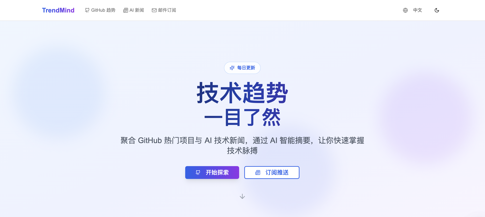
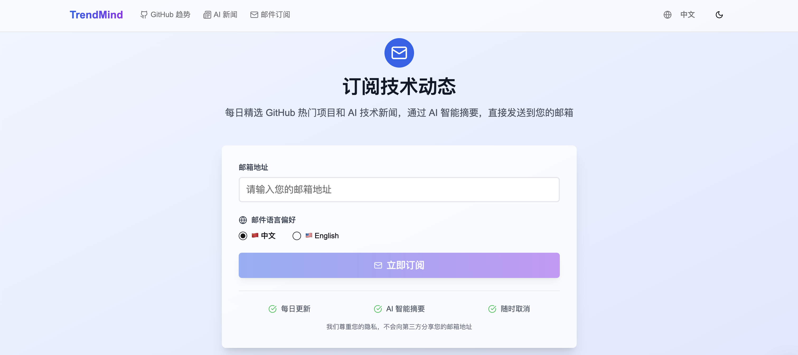
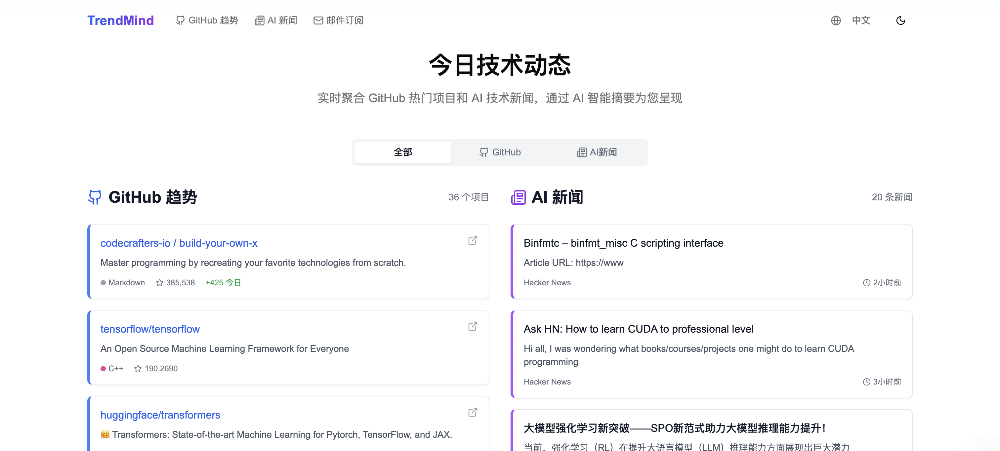

# TrendMind

<div align="center">


*一个智能的技术趋势聚合平台 | An intelligent tech trends aggregation platform*

[中文](#中文版本) | [English](#english-version)

[](https://github.com/your-username/trendmind)
[](https://opensource.org/licenses/MIT)

[](https://vercel.com/new/clone?repository-url=https://github.com/your-username/trendmind)

</div>

---

## 中文版本

TrendMind 是一个技术趋势聚合平台，帮助技术人员、AI 爱好者、开发者快速了解最新的技术动态。

### 📸 项目截图

<div align="center">

**主页展示**


**邮件订阅**


**技术动态**


</div>

### ✨ 功能特性

- 🔥 **GitHub 趋势抓取** - 实时获取 GitHub 热门项目
- 📰 **AI 新闻聚合** - 聚合多个 AI 技术新闻源
- 🤖 **AI 智能摘要** - 使用 DeepSeek-v3 生成中英文摘要
- 🌐 **多语言支持** - 支持中文和英文界面及邮件
- 📧 **邮件推送** - 定时发送技术动态到邮箱
- ⚡ **实时更新** - 每日自动更新内容

### 🛠 技术栈

- **前端**: Next.js 15, React 19, Tailwind CSS, Radix UI
- **后端**: Node.js, TypeScript
- **AI 服务**: DeepSeek-v3 API
- **邮件服务**: Resend
- **部署**: Vercel (支持定时任务)

### 🚀 快速开始

#### 1. 克隆项目

```bash
git clone https://github.com/your-username/trendmind.git
cd trendmind
```

#### 2. 安装依赖

```bash
npm install
# 或
pnpm install
```

#### 3. 配置环境变量

复制 `.env.example` 到 `.env.local` 并填入相应的 API 密钥：

```bash
cp .env.example .env.local
```

需要配置的环境变量：

- `DEEPSEEK_API_KEY`: [DeepSeek AI API 密钥](https://platform.deepseek.com/api_keys)
- `RESEND_API_KEY`: [Resend 邮件服务 API 密钥](https://resend.com/api-keys)
- `FROM_EMAIL`: 发送邮件的地址
- `NEXT_PUBLIC_SITE_URL`: 网站 URL
- `CRON_SECRET`: 定时任务安全密钥

#### 4. 启动开发服务器

```bash
npm run dev
# 或
pnpm dev
```

访问 [http://localhost:3000](http://localhost:3000) 查看应用。

### 📡 API 接口

#### 获取聚合内容

```http
GET /api/content?type=all&refresh=false
```

参数：
- `refresh`: 是否强制刷新缓存 (true/false)
- `type`: 内容类型 (trending/news/all)

#### 邮件订阅

```http
POST /api/email/subscribe
Content-Type: application/json

{
  "email": "user@example.com",
  "language": "zh"
}
```

#### 发送邮件

```http
POST /api/email/send
Content-Type: application/json

{
  "type": "daily",
  "language": "zh",
  "testEmail": "test@example.com"
}
```

### 🚀 部署

#### Vercel 一键部署

[](https://vercel.com/new/clone?repository-url=https://github.com/your-username/trendmind)

#### 手动部署

1. Fork 这个项目到你的 GitHub
2. 在 Vercel 中导入项目
3. 配置环境变量（参见 `.env.example`）
4. 部署

### 🤝 贡献

欢迎提交 Issue 和 Pull Request！我们欢迎以下类型的贡献：

- 🐛 报告 bug
- 💡 提出新功能建议  
- 📝 改进文档
- 🔧 提交代码改进
- 📰 建议新的新闻源

### 💝 支持项目

如果这个项目对您有帮助，欢迎通过以下方式支持：

<div align="center">

**微信支付 | WeChat Pay**


**支付宝 | Alipay**


*您的支持是我们持续改进的动力！*

</div>

### 📄 许可证

MIT License - 查看 [LICENSE](LICENSE) 文件了解详情。

---

## English Version

TrendMind is a tech trends aggregation platform that helps tech professionals, AI enthusiasts, and developers stay up-to-date with the latest technology trends.

### ✨ Features

- 🔥 **GitHub Trending** - Real-time GitHub trending repositories
- 📰 **AI News Aggregation** - Aggregate multiple AI tech news sources  
- 🤖 **AI-Powered Summaries** - Generate summaries using DeepSeek-v3 in both Chinese and English
- 🌐 **Multi-language Support** - Support for Chinese and English interfaces and emails
- 📧 **Email Notifications** - Scheduled delivery of tech trends to your inbox
- ⚡ **Real-time Updates** - Daily automatic content updates

### 🛠 Tech Stack

- **Frontend**: Next.js 15, React 19, Tailwind CSS, Radix UI
- **Backend**: Node.js, TypeScript
- **AI Service**: DeepSeek-v3 API
- **Email Service**: Resend
- **Deployment**: Vercel (with cron jobs support)

### 🚀 Quick Start

#### 1. Clone the repository

```bash
git clone https://github.com/your-username/trendmind.git
cd trendmind
```

#### 2. Install dependencies

```bash
npm install
# or
pnpm install
```

#### 3. Configure environment variables

Copy `.env.example` to `.env.local` and fill in the required API keys:

```bash
cp .env.example .env.local
```

Required environment variables:

- `DEEPSEEK_API_KEY`: [DeepSeek AI API Key](https://platform.deepseek.com/api_keys)
- `RESEND_API_KEY`: [Resend Email Service API Key](https://resend.com/api-keys)
- `FROM_EMAIL`: Email address for sending notifications
- `NEXT_PUBLIC_SITE_URL`: Your application URL
- `CRON_SECRET`: Security key for cron job authentication

#### 4. Start the development server

```bash
npm run dev
# or
pnpm dev
```

Visit [http://localhost:3000](http://localhost:3000) to view the application.

### 📡 API Endpoints

#### Get Aggregated Content

```http
GET /api/content?type=all&refresh=false
```

Parameters:
- `refresh`: Force refresh cache (true/false)
- `type`: Content type (trending/news/all)

#### Email Subscription

```http
POST /api/email/subscribe
Content-Type: application/json

{
  "email": "user@example.com",
  "language": "en"
}
```

#### Send Email

```http
POST /api/email/send
Content-Type: application/json

{
  "type": "daily",
  "language": "en",
  "testEmail": "test@example.com"
}
```

### 🚀 Deployment

#### Deploy with Vercel

[](https://vercel.com/new/clone?repository-url=https://github.com/your-username/trendmind)

#### Manual Deployment

1. Fork this repository to your GitHub
2. Import the project in Vercel
3. Configure environment variables (see `.env.example`)
4. Deploy

### 🤝 Contributing

Issues and Pull Requests are welcome! We welcome the following types of contributions:

- 🐛 Report bugs
- 💡 Suggest new features
- 📝 Improve documentation  
- 🔧 Submit code improvements
- 📰 Suggest new news sources

### 💝 Support This Project

If this project is helpful to you, please consider supporting it:

<div align="center">

**微信支付 | WeChat Pay**


**支付宝 | Alipay**


*Your support motivates us to keep improving! | 您的支持是我们持续改进的动力！*

</div>

### 📄 License

MIT License - see the [LICENSE](LICENSE) file for details.